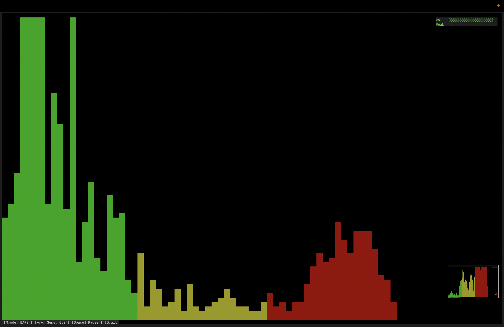
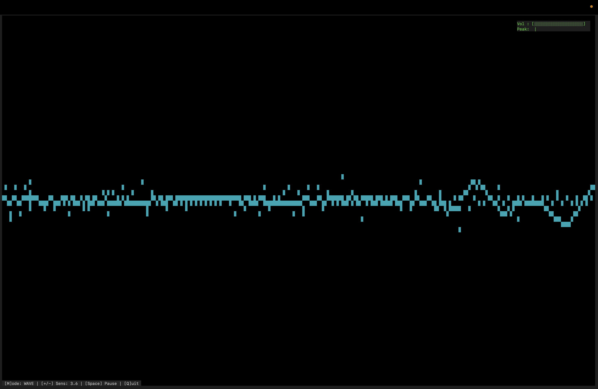
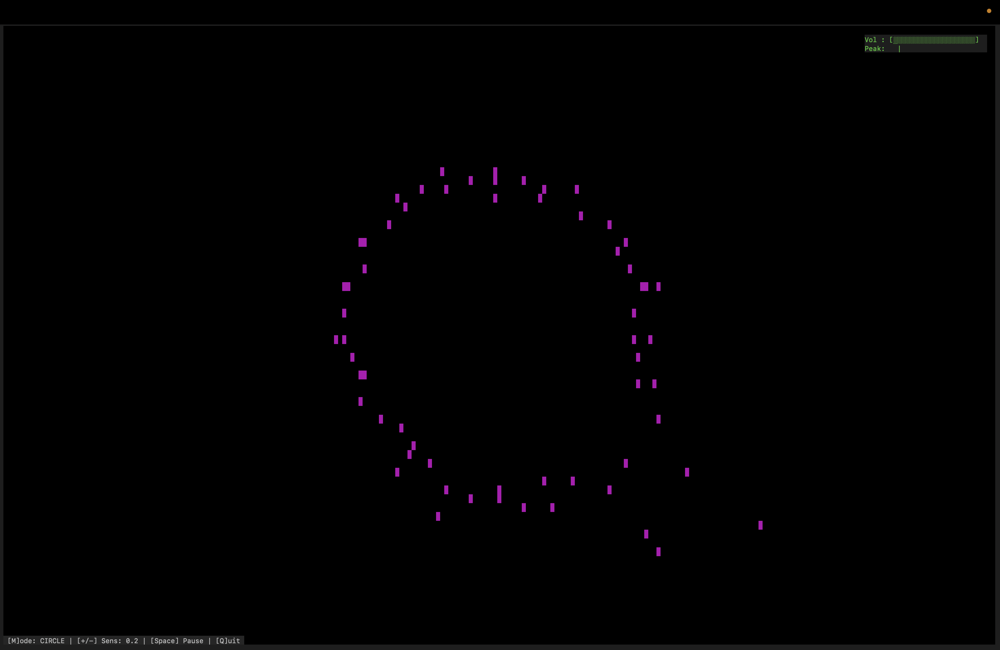

# 🎧 CLI Audio Visualizer

Terminal-based audio visualizer built with Node.js.
Real-time spectrum analysis, waveform rendering, and a volume/peak meter — all inside your terminal.

---

## 📸 Preview

### Bars



### Wave



### Circle



---

## ✨ Features

* 📊 Spectrum bars visualization
* 🌊 Waveform view
* 🔵 Circular visualization
* 🔊 Real-time volume (RMS)
* 📍 Peak meter with smooth decay
* ⚡ Fast and lightweight
* ⌨️ Keyboard controls

---

## 📦 Requirements

* Node.js (>= 16)

### Audio input:

* macOS → `ffmpeg`
* Linux → `sox` (`rec` command)

---

## 🔧 Installation

```bash
git clone 
cd node-cli
npm install
```

---

## ▶️ Usage

```bash
node index.js
```

---

## 🎮 Controls

| Key     | Action                          |
| ------- | ------------------------------- |
| `m`     | Switch visualization mode       |
| `+ / -` | Increase / decrease sensitivity |
| `space` | Pause / resume                  |
| `q`     | Quit                            |

---

## 🔊 Volume Meter

On the right side you will see:

* **Vol** — current loudness (RMS)
* **Peak** — maximum detected level (with smooth decay)

Example:

```
Vol : [██████████░░░░░░░░]
Peak:        |
```

---

## 🧠 How it works

* Captures raw audio from system/microphone
* Converts PCM → float samples
* Uses FFT for frequency analysis
* Calculates RMS for loudness
* Applies smoothing for stable visualization
* Renders UI using terminal graphics

---

## ⚙️ Configuration

You can tweak these values in the code:

```js
const SAMPLE_RATE = 16000;
const FFT_SIZE = 1024;
```

---

## 📌 Notes

* Works best in a large terminal window
* Requires access to an audio input device
* Peak meter uses exponential decay for smoother visuals

---

## 🚀 Future Improvements

* 🎨 Gradient colors (green → yellow → red)
* 🔴 Clip indicator
* 📈 Auto gain normalization
* 🎚️ Stereo support

---

## 📄 License

MIT
